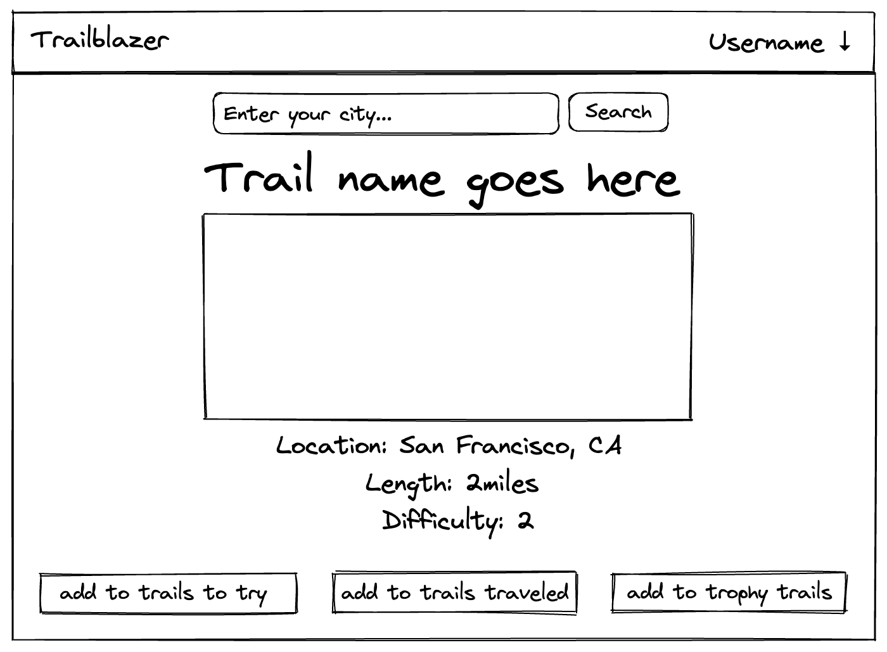

# trailblazer

## WHAT
Trailblazer is an app for anyone who enjoys walking or hiking the world's open trails. Here you can explore and contribute to a collection of trails around the world.

## WHY
I am a nature lover, tree hugger, and feel the most at ease and comforted when walking one of nature's trails. So, I thought, what better way to show that love and appreciation than through an app dedicated the just that.

## USER STORY
As a user, I want to be able to add a new trail to the database, so that I can reference it and other users will be able to find said trail.  
As a user, I want to be able to view all trails in the database, regardless of location, so that I can browse trails in other areas.  
As a user, I want to be able to view a specific trail when I click its name, so that I can see the location and length of the trail.  
As a user, I want to have the ability to update trail information or delete a trail from the database, so that the data is current and up to date.

## WIREFRAME

## TECHNOLOGIES 
  * HTML
  * CSS
  * Javascript
  * Express 
  * EJS
  * MongoDB
  * Mongoose

  ### FRAMEWORKS 
  * Fomantic UI

## INSTALLATION
Follow <a href="https://express-trailblazer.herokuapp.com/trails"> this link</a> to enjoy Trailblazer in your browser.

## UNSOLVED PROBLEMS
* Adding a search bar for users to search trails in their local area.
* Having the background picture cover entire browser window when the user scrolls down. 

## FORTHCOMING FEATURES 
  * User can search for trails by their name or location.
  * User can create their own profile and save specific trails to their account. 
